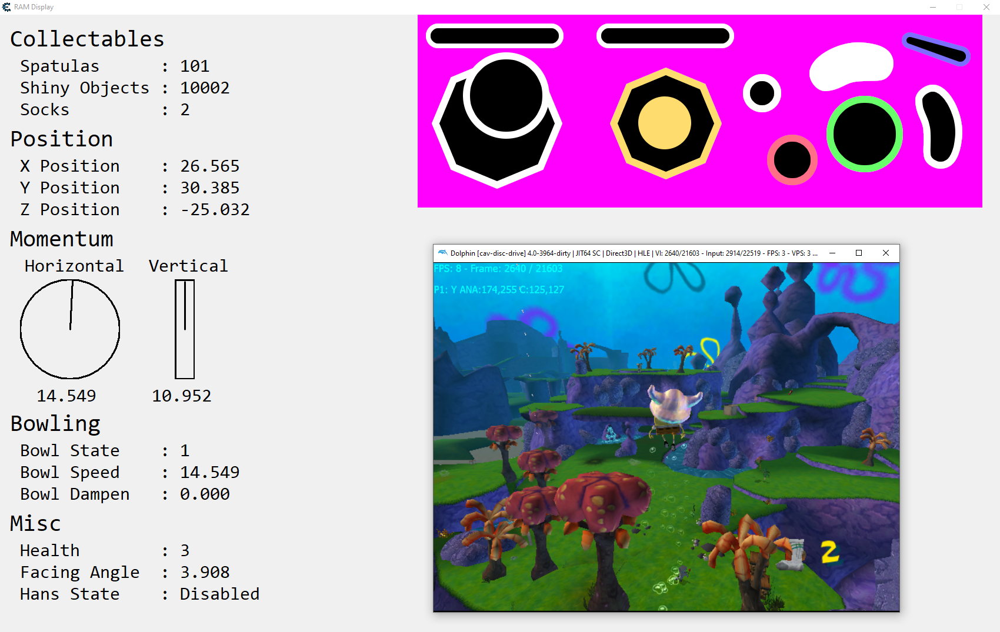

# ram-watch-cheat-engine (BFBB)

Sample video: [Kelp Forest IL 100% TAS by me](https://www.youtube.com/watch?v=Xpk-47ILqLc)

## Overview

This fork is focused on altering the ram-watch-cheat-engine tool for use with Spongebob Squarepants: Battle for Bikini Bottom.
For the original tool checkout [yoshifans repository](https://github.com/yoshifan/ram-watch-cheat-engine).

Credit goes to user skyweiss for building the initial layout and Hazel (FusionVaria) for bringing this to my attention and providing feedback.
I worked off of the initial version to fix a bug with the input viewer, improve/add layout options, build the momentum visualization and add a kind of hacky but useful frame dump feature.

In the following I will give an overview on the layouts and how to use the tool.

## Layouts

Available layouts include
- `'normal'` - the initial layout style skyweiss used
- `'mono'` - a more streamlined version of the normal layout using a monospaced font and horizontally alligning memory values
- `'render'` - an upscaled version of the mono layout for better quality when rendering videos

Layouts are defined in `games\bfbb_layouts.lua`. Here you can adjust positioning and other parameters of the components.

## Usage instructions

1. clone or download (click Code -> Download ZIP) this repository.
2. open the `bfbb.ct` cheat table included in the `user_files` directory with a text editor
3. adjust the `RWCEMainDirectory` path such that it points to the root of this repository
4. start BFBB inside Dolphin
5. start CheatEngine and hook to the Dolphin process
6. open `bfbb.ct` and values/inputs should start being displayed

## Frame dumping

The frame dump feature is really just taking screenshots on every frame which afterwards can be packed into a video.

In order to work it relies on two external tools:
- [NirCmd](https://nircmd.nirsoft.net) - for automatically taking screenshots (download at the bottom)
- [ffmpeg](https://www.gyan.dev/ffmpeg/builds/) - for packing screenshots into video (scroll to release and download either full or essentials version)

To set everything up follow these steps:
1. create a folder for the screenshots (make sure it has enough available space, one minute of frame images can be ~5GB for me)
2. download NirCmd and ffmpeg
3. Open `bfbb.ct` in a text editor and set the following:
	- `layoutName = 'render'`
	- `dumpFrames = true`
	- `nirCmdDirectory = [[C:\downloadpath\nircmd.exe]]`
	- `imgOutDirectory = [[C:\path\to\created\screenshot\folder]]`
4. open `bfbb.ct` in CheatEngine (I recommend arranging the ram viewer and Dolphins render window as shown in the screenshot above to make syncing with the Dolphin framedump easier)
5. playback the TAS movie and every frame a screenshot will be placed into `imgOutDirectory`

Unfortunately the command prompt will always flash on every screenshot. If this overlays the viewer follow these steps to work around that:
1. open a new command prompt by typing `cmd` into the start menu
2. drag it to a position where its not overlaying the viewer (possibly onto a 2nd monitor if you have one)
3. right click the title bar -> `Properties` -> `Layout`
4. your current window position is shown, remember the coordinates
5. close `Properties`, right click title bar again -> `Defaults` -> `Layout`
6. uncheck `Let system position window` and put in the coords from earlier
7. now the command prompt will flash in this position where its not obstructing the framedump

If you reached the end of the movie you will now have to pack the screenshots into a video. To do so follow these steps:
1. copy and paste the `pack_frames.bat` script included in the `user_files` directory into the screenshot folder
1. copy and paste the `ffmpeg.exe` file from `downloadpath\bin` into the screenshot folder
3. execute it and follow the instructions

Congratz! you can go ahead and edit your video now (:

## Known issues

- the buttons for the input viewer are hooked to the games `pressed` and `released` events. That means loading a savestate in Dolphin before a button is released will cause the viewer to keep displaying it as pressed until it's released again.
- some inputs will not be displayed, most notable to me B inputs on textboxes are not recognized. But i can pretty much guarantee that all movement relevant inputs will be displayed as they are read the exact same way the games movement code reads them (as researched in the decomp project).

## Feedback

If you experience a problem feel free to open an issue or contact me on Discord (P3bk4c#3450)
